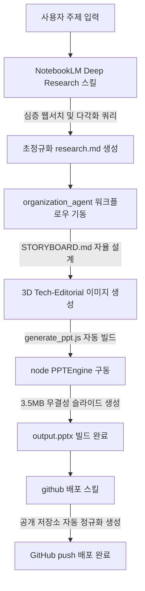

# 🚀 End-to-End AI Deep Research & Presentation Engine
> **Powered by Antigravity AI Brain & NotebookLM MCP**

본 프로젝트는 AI 기술과 자율 에이전트 아키텍처를 결합하여, **주제 입력 한 번으로 심층 웹 리서치부터 스토리보드 설계, 3D 시각화 에셋 생성, 그리고 무결성 PPTX 슬라이드 빌드와 GitHub 배포까지 단 한 번에 수행하는 초격차 프레젠테이션 자동 생산 시스템**입니다.

---

## 🌟 핵심 파이프라인 (End-to-End Workflow)



---

## 🛠️ 주요 스킬 및 기능

### 1. 🔍 NotebookLM 딥 리서치 (`/research` 스킬)
*   **초심층 웹 및 드라이브 서칭**: `--mode deep` 모드를 탑재하여 Google Web & Drive 전반을 종횡무진 탐색합니다.
*   **쿼리 확장 & 재구성 (Query Expansion)**: 사용자의 원본 쿼리를 안티그래비티 지능으로 분석하여 영어/한국어 다각화 쿼리로 팽창시킵니다.
*   **시장 조사 및 경쟁 분석 강화**: 비즈니스 필수 레이어인 ROI(투자대비효과), 실질 사례(Case Study), 행동 방안(Action Plan)에 더해 **시장 규모 및 경쟁사 분석(Market Size & Competitors)**을 고정으로 추가 탐색합니다.
*   **Blueprint 규격화**: 최종 리서치 결과물은 슬라이드 설계 매핑 Blueprint가 포함된 정규화 포맷 `research.md`로 자동 저장됩니다.

### 2. 🎨 PPT 자동 생산 워크플로우 (`/organization_agent`)
*   **스토리보드 자율 설계**: `research.md`를 완벽히 분석하여 `engine.js`의 슬라이드 배치 함수 및 레이아웃과 100% 매칭되는 `STORYBOARD.md`를 자율적으로 생성합니다.
*   **3D Tech-Editorial 이미지 에셋**: 3D 테크 에디토리얼 및 학술 도해(Academic Style)가 융합된 초고품질의 이미지 에셋 5장을 자율 생성하여 `assets/` 경로에 완벽히 이식합니다.
*   **전용 빌더 스크립트 작성**: `PPTEngine` 클래스를 동적으로 임포트하여 슬라이드 10장을 오차 없이 그려내는 `generate_ppt.js`를 빌드합니다.
*   **무결성 PPTX 최종 렌더링**: 로컬 node 엔진을 기동해 약 3.5MB 크기의 고품질 무결성 `output.pptx` 프레젠테이션 파일을 자율 생산합니다.

### 3. 🚀 GitHub 자동 배포 (`/github` 스킬)
*   **로컬 Git 자동화**: 로컬 저장소의 `git init`, `git add .`, `git commit -m "research 및 ppt 연동 완료"`, `main` 브랜치 정리를 원클릭으로 기동합니다.
*   **특수문자 자동 정규화**: 깃허브 정책 상 생성 불가능한 특수문자(예: `+`)를 대시(`-`)로 스마트하게 자동 치환(`6_ppt_design-research`)하여 에러를 원천 방지합니다.
*   **공개(Public) 배포 지원**: 조직 및 개인 계정(`nam-ai-trend`) 하위에 공개(Public)로 원격 저장소를 API로 즉시 자동 생성하고 `git push`까지 원스톱으로 마무리합니다.

---

## 📂 폴더 구조

```
6_ppt_design_skill  +research/
│
├── .agents/                         # 에이전트 스킬 및 워크플로우 핵심부
│   ├── workflows/
│   │   └── organization_agent.md    # 🔑 PPT 자동 생산 워크플로우 정의
│   └── skills/
│       ├── research/                # 🔍 NotebookLM MCP 딥 리서치 스킬
│       │   ├── SKILL.md             # 리서치 가이드 및 고정 질문 룰
│       │   └── assets/              # 프롬프트 톤앤매너
│       ├── simple-design-ppt/       # 🎨 Tech-Editorial 디자인 테마 스킬
│       │   ├── SKILL.md             # 디자인 시스템 규격 및 매뉴얼
│       │   └── engine.js            # PPTEngine 클래스 (슬라이드 드로잉 엔진)
│       └── github/                  # 🚀 GitHub 원격 자동 배포 스킬
│           ├── SKILL.md             # 배포 스펙 가이드
│           └── scripts/
│               └── github_ops.py    # Git 및 GitHub API 배포 파이썬 스크립트
│
├── outputs/                         # 최종 산출물 폴더 (주제별 격리)
│   └── 260522_notebooklm_vs_claude/ # 예시: NotebookLM vs Claude 분석
│       ├── research.md              # ✏️ 초정규화 리서치 마크다운 (Blueprint 포함)
│       ├── STORYBOARD.md            # 📝 슬라이드 10장 구성 기획안
│       ├── generate_ppt.js          # 💻 PPTX 빌더 구동 스크립트
│       ├── NotebookLM_vs_Claude_Research.pptx # 🎁 최종 프레젠테이션 파일
│       └── assets/                  # 🖼️ 3D Tech-Editorial 이미지 에셋들
│
├── package.json
├── .env                             # Gemini API Key & GITHUB_TOKEN 보관
└── README.md
```

---

## 🎨 디자인 시스템: `simple-design-ppt`

**Tech-Editorial & Academic 하이브리드** 스타일로, 엔터프라이즈 AI 및 딥 테크 발표 자료에 최적화된 최정점의 레이아웃을 제공합니다.

### 제공 슬라이드 타입 8종
1.  **Title Slide**: 좌측 대형 타이틀 + 우측 Bleed 실사 3D 에셋 이미지 배치
2.  **Agenda Slide**: 번호 뱃지 + Y축 자동 센터링 리스트 구조
3.  **Divider Slide**: 다크 테마(`#18181B`)를 이용한 시각 환기용 섹션 구분
4.  **Content (Image) Slide**: 좌측 설명 텍스트 + 우측 1:1 정사각형 에셋 이미지
5.  **Card Layout Slide**: 2~5단 카드 그리드 기반의 메인 텍스트 정보 시각화
6.  **Comparison Slide**: AS-IS 대 TO-BE의 정밀 비교 및 프로세스 흐름도 시각화
7.  **Data/KPI Slide**: 대형 숫자 데이터 블록과 연동 테이블 결합 구조
8.  **Closing Slide**: 핵심 키 비주얼 에셋 + 우측 마무리 이미지 연동

---

## 📦 실행 및 기동 방법

### 1. 의존성 설치
```bash
npm install
```

### 2. 딥 리서치 기동 (NotebookLM MCP)
```bash
/research "자료조사는 노트북엘엠이 최고라는 팩트와 클로드 바이브코딩 비교분석"
```
*   `outputs/[날짜_주제명]/research.md`가 자동 빌드됩니다.

### 3. PPTX 및 이미지 자동 빌드 기동
```bash
/organization_agent outputs/[날짜_주제명]/research.md
```
*   `outputs/[날짜_주제명]/` 하위에 `STORYBOARD.md`, 이미지 에셋, `generate_ppt.js`가 자동 생성되며 `output.pptx`가 렌더링됩니다.

### 4. GitHub 자동 배포 기동
```bash
/github 6_ppt_design+research
```
*   `6_ppt_design-research` 공개 저장소 생성 및 푸시가 단숨에 완료됩니다.

---
**Created & Maintained by Antigravity & NAM AI TREND**
